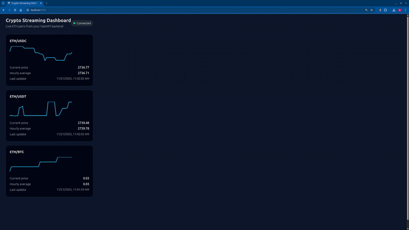

# Crypto Streaming Dashboard

FastAPI backend + React/TypeScript frontend streaming Ethereum pairs in real time via WebSockets.  
Runs fully in Docker — no local Python or Node setup required.

---

## Project Summary
- Real-time ETH pair streaming (REST snapshot + WebSocket updates)
- Clean architecture: API → Service → Repository → Domain
- React hook (`useRatesStream`) merges snapshot + stream with minimal re-renders

---

## Preview (GIF or Screenshot)

```

```

---

## Environment Setup

1. Clone the repository  
2. Copy environment example:
```bash
cp backend/.env.example backend/.env
```
3. Edit the file:
```env
FINNHUB_API_KEY=your_key_here
```

---

## Architecture

### Backend (FastAPI)
- REST endpoint: initial snapshot  
- WebSocket endpoint: continuous updates  
- In-memory aggregator:
  - tick ingestion
  - hourly rollovers
  - independent per-pair state

### Frontend (React + TypeScript)
- `useRatesStream` = merges REST + WebSocket  
- Handles connection lifecycle  
- Keeps UI in sync with minimal updates  

---

## Endpoints

```
GET   /api/v1/rates/current   → snapshot
WS    /ws/rates               → live stream
```

---

## Data Flow

1. Frontend requests snapshot  
2. Opens WebSocket  
3. Backend streams updates  
4. React merges both sources in real time  

---

## Running (Docker Only)

Start:
```bash
make docker-up
```

Access:
- Frontend: http://localhost:5173  
- Backend docs: http://localhost:8000/docs  

Stop:
```bash
make docker-down
```

Restart:
```bash
make docker-restart
```

---

## Backend Tests

Run:
```bash
make backend-tests
```

Covers:
- Tick ingestion  
- Hour rollover  
- Pair-specific state tracking  

---

## Development

```bash
make backend-shell
make frontend-shell
```

---

## Stack

- FastAPI  
- WebSockets  
- Pydantic  
- React + TypeScript  
- Docker  
